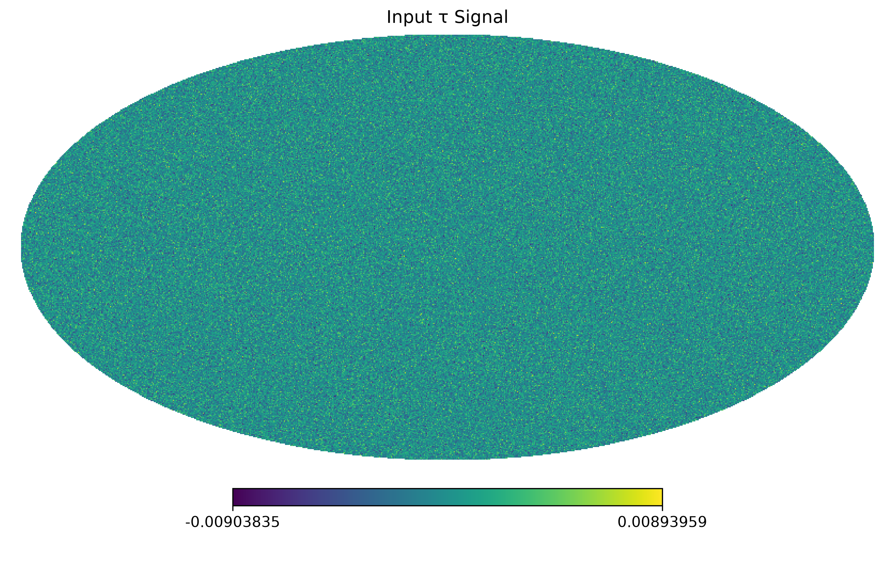
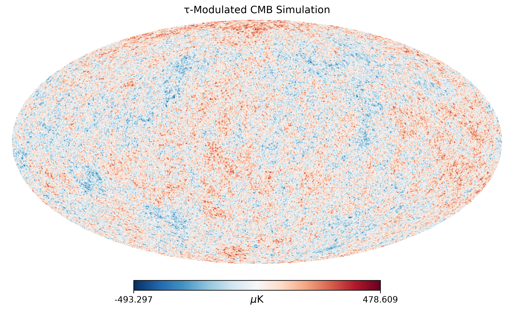
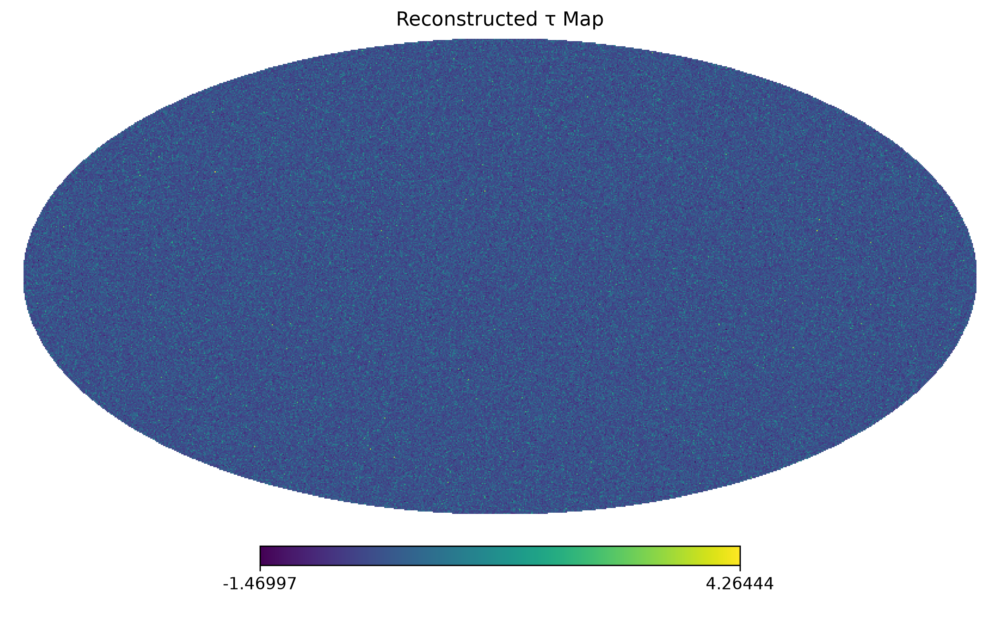
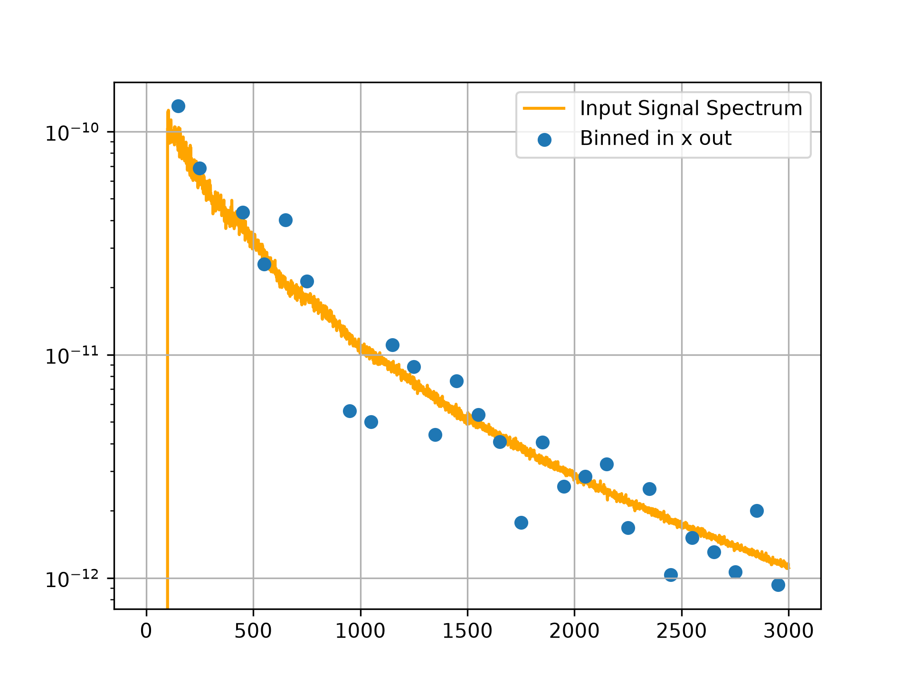

# Demonstration of weak signal reconstruction with the cosmic microwave background

A simulation-based demonstration of weak-signal reconstruction using CMB patchy screening as a test case.
This project generates simulated CMB data with a known optical-depth fluctuation field and reconstructs the injected signal using a quadratic estimator.

## Pipeline

1. **Simulate:** Generate Gaussian random field CMB simulations and inject a known patchy screening signal based on a theoretical model from the literature.

2. **Reconstruct:** Apply a temperature-based quadratic estimator to the simulated CMB data and normalize the reconstructed optical-depth field.

3. **Validate:** Calculate the cross-power spectrum between the input optical-depth field and the reconstructed field to check for recovery of the injected signal.

## Example Results

The following plots illustrate the simulated CMB data, reconstructed optical-depth field, and pipeline validation.

### Input Simulation


The simulation stage generates a CMB temperature field with an injected patchy screening signal, both from theory signals. Because the input optical-depth field is known, it provides a reference against which the reconstructed signal can be tested.

### Simulated CMB Temperature Map


This map shows the simulated CMB temperature field after injecting patchy screening and adding instrumental noise. It represents the observed data used as input to the reconstruction pipeline. The temperature fluctuations are shown in µK.

### Reconstructed Signal


A temperature-based quadratic estimator is applied to the simulated CMB data to reconstruct the optical-depth fluctuations. The estimator uses CMB correlations induced by patchy screening to extract information about the injected signal.

### Pipeline Validation


The cross-power spectrum between the input optical-depth field and the reconstructed field is used to test whether the pipeline recovers the injected signal.

## Installation and Usage

Clone the repository and create a Python virtual environment:

```bash
git clone https://github.com/darbykramer/signal-reconstruction-demo.git
cd signal-reconstruction-demo

python -m venv .venv
source .venv/bin/activate

pip install -r requirements.txt
```

Run the simulation, reconstruction, and plotting scripts:

```bash
cd src

python simulate.py --savepath ../output/ --noiselevel 10 --nsims 1

python reconstruct.py --simpath ../output/

python plotting.py --simpath ../output/ --savepath ../output/
```

The generated figures and simulation files are saved in the `output/` directory.

## Status

The simulation, reconstruction, and validation pipeline runs end-to-end using the dependencies listed in `requirements.txt`.

MPI support may be added in a future update.
